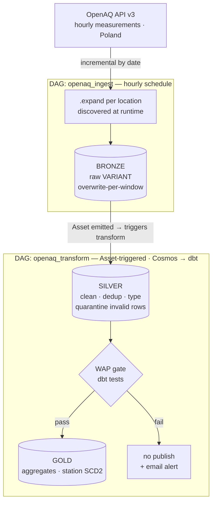

# airflow-openaq-medallion

A production-grade air-quality data pipeline (OpenAQ, Poland) built on Apache Airflow 3 and Snowflake, in a medallion architecture (bronze → silver → gold), with a **Write-Audit-Publish (WAP)** quality gate based on dbt tests and native Airflow email alerting.

A portfolio project demonstrating production orchestration patterns: incremental ingest, dynamic task mapping, data-aware scheduling, granular dbt integration via Cosmos, and deliberate data-quality and observability decisions.

---

## Architecture



Alerting is native to Airflow: a custom `BaseNotifier` emails on task failure (via `on_failure_callback`), and Deadline Alerts flag runs that exceed their expected duration. No external monitoring stack.

---

## Design rationale

The full decision log lives in [docs/adr/](docs/adr/). Highlights:

| Decision | Why | ADR |
|---|---|---|
| Medallion (bronze/silver/gold) | Separate raw / cleaned / business data; reprocess without re-fetching from the API | [0002](docs/adr/0002-medallion-architecture.md) |
| WAP gate via dbt tests | Data reaches gold only after a quality audit; OpenAQ has gaps, duplicates, and out-of-range values | [0003](docs/adr/0003-wap-quality-gate.md), [0004](docs/adr/0004-wap-failure-handling.md) |
| dbt via Cosmos (per-model tasks) | Granular retries and a readable graph instead of a monolithic `dbt run` | [0005](docs/adr/0005-dbt-via-cosmos.md) |
| Scheduled ingest + Asset-driven transform | The transform runs when data lands, not on a guessed cron offset | [0006](docs/adr/0006-scheduling-model.md) |
| Dynamic task mapping per location | v3 exposes data per sensor/location; per-station fault isolation over a runtime-discovered set | [0007](docs/adr/0007-dynamic-task-mapping-per-location.md) |
| Bronze overwrite-per-window (not MERGE) | Idempotent yet raw/append; dedup and keys belong in silver/gold | [0008](docs/adr/0008-bronze-load-strategy.md) |
| Airflow 3.2+ & Deadline Alerts | The classic task SLA was removed in Airflow 3.0; Deadline Alerts are the DAG-level replacement | [0001](docs/adr/0001-airflow-3-deadline-alerts.md) |

---

## Scope

- **Geography:** all of Poland (150+ GIOŚ stations available via OpenAQ).
- **Pollutants:** PM2.5, PM10, NO2, O3, SO2.
- **Cadence:** hourly.
- **Working window:** a rolling 30-day window; a one-time backfill of the full calendar year 2025 is planned to provide a complete year of history.

---

## Stack

- **Orchestration:** Apache Airflow 3.2+ via the Astro CLI
- **Transformations:** dbt-core + dbt-snowflake, run via `astronomer-cosmos`
- **Warehouse:** Snowflake (BRONZE / SILVER / GOLD layers)
- **Source:** OpenAQ API v3 (Poland)
- **Alerts:** email (SMTP) via a custom `BaseNotifier`
- **CI:** GitHub Actions (lint + DAG-integrity tests + `dbt build`)

---

## Reliability & operations

- **Idempotency** — bronze is loaded by overwrite-per-window; silver/gold use dbt incremental (merge). Re-running a window does not duplicate data.
- **Backfill** — date-parameterized loads allow safe historical processing (including the 2025 backfill), chunked to respect OpenAQ rate limits (60/min, 2000/h).
- **Data quality** — the WAP gate publishes to gold only after dbt tests pass; expected dirt is quarantined in silver, integrity violations block publication.
- **Alerting** — email on task failure via a custom `BaseNotifier`; Deadline Alerts on run overruns.
- **Secrets** — connections/variables and the OpenAQ key live outside code (`.env` / Secrets Backend); the repo ships only `.env.example`.
- **CI** — DAG-integrity tests (`pytest`) + lint + `dbt build` on every PR; branch protection requires green checks before merge.

---

## Repo structure

```
airflow-openaq-medallion/
├── dags/
│   ├── openaq_ingest.py          # bronze: incremental ingest (dynamic mapping)
│   ├── openaq_transform.py       # silver → gold via Cosmos (dbt)
│   └── callbacks.py              # shared alerting callbacks
├── dbt/openaq/
│   ├── models/
│   │   ├── silver/               # clean, dedup, type, quarantine
│   │   └── gold/                 # aggregates + station dimension
│   ├── snapshots/                # station SCD2
│   ├── tests/                    # dbt tests = quality gate
│   └── dbt_project.yml
├── include/
│   ├── sql/                      # bronze DDL + load
│   └── notifications/notifier.py # custom email BaseNotifier
├── tests/test_dag_integrity.py
├── docs/
│   ├── PRD.md
│   └── adr/                      # architecture decision records
├── .github/workflows/ci.yml
├── Dockerfile                    # Astro runtime image
├── requirements.txt
├── .env.example
└── README.md
```

---

## Run

```bash
cp .env.example .env      # fill in Snowflake + SMTP + OpenAQ credentials
astro dev start
```

The `openaq_ingest` DAG loads data into BRONZE and emits an Asset, which triggers `openaq_transform` (dbt via Cosmos) with the WAP gate before publishing to GOLD.

---

## Data & attribution

Air-quality data is sourced from the [OpenAQ](https://openaq.org) API (v3). For Poland the underlying measurements are provided by **GIOŚ** (Główny Inspektorat Ochrony Środowiska). This data is subject to OpenAQ's and the originating providers' terms; it is **not** relicensed by this project, and no raw data is committed to the repository. A free OpenAQ API key is required and is supplied as a secret via `.env`.

## License

The code in this repository is released under the [MIT License](LICENSE). The license covers the project's own code, not the third-party data described above.
