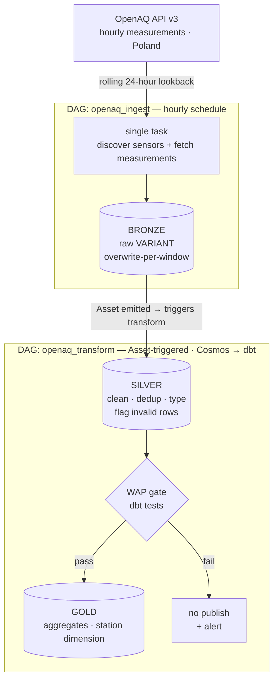

# airflow-openaq-medallion

An air-quality data pipeline for OpenAQ data from Poland, built with Apache Airflow 3 and Snowflake.

> **Work in progress.** The repository is being built incrementally; completed milestones are available now, while unchecked milestones describe the remaining work.

## Progress

- ✅ **M0 — Local Airflow environment and baseline CI.** Astro starts the local runtime and CI runs lint and DAG-integrity checks.
- ✅ **M1 — Snowflake foundation.** Bootstrap SQL provisions the warehouse, medallion schemas, roles, service users, and a smoke-test connection.
- ✅ **M2 — OpenAQ client.** The standalone client discovers sensors and retrieves paginated measurements within the API request limit.
- ⬜ **M3 — Bronze ingest.** An hourly DAG will load the rolling 24-hour window into bronze and emit an Airflow Asset.
- ⬜ **M4 — dbt transformation.** An Asset-triggered Cosmos DAG will run dbt models and tests, with `dbt build` added to CI.
- ⬜ **M5 — Silver layer.** Transformations will clean, type, and deduplicate measurements while retaining invalid records for inspection.
- ⬜ **M6 — Data contracts.** The pipeline will detect breaking upstream schema changes before they reach gold.
- ⬜ **M7 — Quality gate and gold.** dbt tests will gate publication of the first gold mart.
- ⬜ **M8 — Backfill and serving.** The historical backfill and a Snowsight dashboard will complete the end-to-end pipeline.


## Target architecture


```mermaid
flowchart TD
    API["OpenAQ API v3<br/>hourly measurements · Poland"]

    subgraph ingest["DAG: openaq_ingest — hourly schedule"]
        INGEST["single task<br/>discover sensors + fetch measurements"]
        BRONZE[("BRONZE<br/>raw VARIANT<br/>overwrite-per-window")]
        INGEST --> BRONZE
    end

    subgraph transform["DAG: openaq_transform — Asset-triggered · Cosmos → dbt"]
        SILVER[("SILVER<br/>clean · dedup · type<br/>flag invalid rows")]
        GATE{"WAP gate<br/>dbt tests"}
        GOLD[("GOLD<br/>aggregates · station dimension")]
        SILVER --> GATE
        GATE -->|pass| GOLD
        GATE -->|fail| STOP["no publish<br/>+ alert"]
    end

    API -->|rolling 24-hour lookback| INGEST
    BRONZE -->|Asset emitted → triggers transform| SILVER
```


## Design rationale

Key architectural decisions:


| Decision                                               | Why                                                                                                         | ADR                                                                                      |
| ------------------------------------------------------ | ----------------------------------------------------------------------------------------------------------- | ---------------------------------------------------------------------------------------- |
| WAP gate via dbt tests                                 | Data reaches gold only after a quality audit; OpenAQ has gaps, duplicates, and out-of-range values          | [0003](docs/adr/0003-wap-quality-gate.md), [0004](docs/adr/0004-wap-failure-handling.md) |
| dbt models and tests as Airflow tasks                  | Airflow exposes the status and dependencies of individual dbt nodes                                         | [0005](docs/adr/0005-dbt-via-cosmos.md)                                                  |
| Isolated dbt environment                               | Cosmos runs dbt in `LOCAL` mode from a dedicated virtualenv, keeping dbt dependencies separate from Airflow | —                                                                                        |
| Scheduled ingestion and asset-triggered transformation | The transform runs after ingestion writes data to bronze                             | [0006](docs/adr/0006-scheduling-model.md)                                                |
| Bronze load by overwrite window                        | Re-fetching the 24-hour window refreshes bronze without retaining duplicate retrievals                      | [0008](docs/adr/0008-bronze-load-strategy.md)                                            |
| Scheduled provider scope                               | Scheduled ingestion targets the providers that returned measurements in the source audit                     | [0009](docs/adr/0009-scheduled-provider-scope.md)                                        |


---


## Scope

- **Geography:** all of Poland.
- **Scheduled providers:** EEA and AirGradient.
- **Pollutants:** PM2.5, PM10, NO2, O3, SO2, CO, BC (black carbon).
- **Cadence:** hourly.
- **Ingest lookback:** a rolling 24-hour lookback per scheduled run; a one-time backfill of the full calendar year 2025 is planned to provide a complete year of history.

---


## Current and planned stack

- **Orchestration:** Apache Airflow 3 via the Astro CLI.
- **Warehouse:** Snowflake, provisioned with bronze, silver, and gold schemas.
- **Source client:** OpenAQ API v3.
- **Transformations:** dbt-core and dbt-snowflake via `astronomer-cosmos` (M4).
- **CI:** GitHub Actions runs lint and DAG-integrity tests; `dbt build` is added in M4.

---

## Source audit

`openaq_audit` is a manual DAG that checks every target-parameter sensor discovered in Poland for a requested UTC window and stores one result per sensor in Snowflake. It covers all Polish providers; scheduled ingestion uses the provider scope defined in [ADR-0009](docs/adr/0009-scheduled-provider-scope.md).

---


## Target pipeline behaviour

- **Idempotency** — bronze will use overwrite-per-window and silver/gold dbt incremental models, so reprocessing does not duplicate data.
- **Ingest** — one task will fetch sensors sequentially within the OpenAQ request limit.
- **Asset emission** — ingest will emit an Asset when the bronze contents for the refreshed window change through added, modified, or removed measurements.
- **Backfill** — date-parameterized loads will support the 2025 backfill in rate-limit-aware chunks.
- **Data quality** — the WAP gate will publish to gold only after dbt tests pass; invalid source records will remain available for inspection in silver, while data-contract failures will block publication and trigger an alert.
- **Secrets** — connections and the OpenAQ key live outside code (`.env` or a Secrets Backend); the repository ships only `.env.example`.

---


## Planned repository structure

```text
airflow-openaq-medallion/
├── dags/
│   ├── openaq_ingest.py          # bronze: rate-limited hourly ingest
│   ├── openaq_transform.py       # silver → gold via Cosmos (dbt)
├── dbt/openaq/
│   ├── models/
│   │   ├── silver/               # clean, dedup, type, flag invalid rows
│   │   └── gold/                 # aggregates + station dimension
│   ├── tests/                    # dbt tests = quality gate
│   └── dbt_project.yml
├── include/
│   ├── openaq/                   # OpenAQ v3 client (pure Python, no Airflow)
│   │   ├── client.py             # pagination, retries, window parameterisation
│   │   ├── ratelimit.py          # sliding-window pacing (60/min, 2000/h)
│   │   ├── spike.py              # live check of the API assumptions
│   │   └── audit.py              # manual source audit
│   ├── sql/
│   │   ├── bootstrap/            # idempotent Snowflake provisioning (RBAC + schemas)
│   │   └── tests/               # negative-permission checks
├── tests/
│   ├── test_dag_integrity.py
│   └── test_openaq_client.py
├── docs/
│   ├── PRD.md
│   └── adr/                      # architecture decision records
├── .github/workflows/ci.yml
├── Dockerfile                    # Astro runtime image
├── requirements.txt
├── .env.example
└── README.md
```

---


## Use the repository


### Start locally

**One-time Snowflake setup.** Generate RSA key pairs for `AIRFLOW_USER` and `OPENAQ_CI_USER`, then paste their public keys into `03_users.sql`. Run the idempotent bootstrap scripts once as an admin to provision the warehouse, database, medallion schemas, least-privilege roles, and service users. The exact commands are in [include/sql/bootstrap/](include/sql/bootstrap/README.md). The pipeline then runs as the least-privilege role `OPENAQ_PIPELINE`.

```bash
cp .env.example .env      # `account` as <org>-<account>, + OpenAQ;
                          # the private-key path is already set
astro dev start
```

Trigger the `_snowflake_smoke` DAG to confirm the connection (it logs the Snowflake version and `current_role=OPENAQ_PIPELINE`). Once ingest lands, the `openaq_ingest` DAG loads data into BRONZE and emits an Asset, which triggers `openaq_transform` (dbt via Cosmos) with the WAP gate before publishing to GOLD.

---


### Validate Python changes

Run Ruff in the Astro runtime image before committing Python changes:

```bash
docker build -t openaq-airflow:lint .
docker run --rm -v "$PWD":/workspace -w /workspace openaq-airflow:lint sh -lc 'python -m pip install --no-cache-dir ruff==0.15.22 && python -m ruff check .'
```

Build the Astro Runtime image before running tests:

```bash
docker build -t openaq-airflow:ci .
docker run --rm openaq-airflow:ci python -m pytest tests -v
```

Run one test module by replacing `tests` with its path:

```bash
docker run --rm openaq-airflow:ci python -m pytest tests/test_openaq_client.py -v
```

Rebuild the image after changing the `Dockerfile` or `requirements.txt`.

---


## Data & attribution

Air-quality data is sourced from the [OpenAQ](https://openaq.org) API (v3). This data is subject to OpenAQ's and the originating providers' terms; it is **not** relicensed by this project, and no raw data is committed to the repository. A free OpenAQ API key is required and is supplied as a secret via `.env`.

## License

The code in this repository is released under the [MIT License](LICENSE). The license covers the project's own code, not the third-party data described above.
